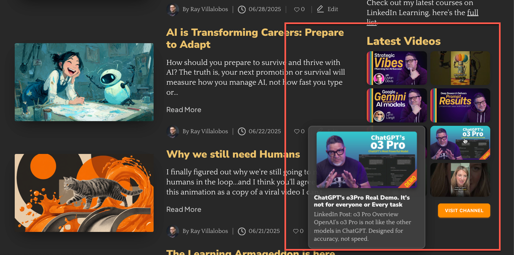

# Flex Videos

[](https://itsplaitime.com)
A WordPress plugin for displaying responsive YouTube video grids with modern flyout overlays and customizable styling. Full demo on [itsPlaiTime.com](https://itsplaitime.com/)

## Key Features

- **YouTube Grid Display** - Show video thumbnails from any YouTube channel in a responsive grid
- **Modern Flyout Overlay** - Hover over thumbnails to see an animated overlay with full video details
- **Customizable Button Colors** - Admin color pickers for channel link button styling
- **Responsive Design** - Looks great on all devices with configurable column layouts
- **Built-in Caching** - API responses are cached for optimal performance
- **Optimized Thumbnails** - Medium resolution for grid performance, high-resolution for overlay quality
- **WordPress Compatible** - Follows WordPress coding standards and best practices

## What Makes It Special

### Smart Overlay System
- **Fade-in animation** with smooth transitions
- **Never clipped** - automatically repositions at viewport edges  
- **High-resolution thumbnail** preview with full title and description text
- **Left-aligned layout** for consistent, professional appearance

### Professional Grid Layout
- **Semantic HTML** wrapped in `wp-block-group` for block theme compatibility
- **Optimized spacing** with separate controls for grid gaps
- **Configurable columns** (1-10 columns supported)

### Admin-Friendly Customization
- **Color picker controls** for button background, hover, and text colors
- **Show/hide toggles** for grid title, description, and channel link
- **Custom text options** for grid title, description, and button text
- **Cache management** and settings reset tools for troubleshooting

## Installation

### WordPress Admin (Recommended)
1. Download the latest release ZIP from [GitHub Releases](https://github.com/planetoftheweb/flex-videos/releases)
2. Go to **Plugins > Add New** in WordPress admin
3. Click **Upload Plugin** and select the ZIP file
4. Click **Install Now**, then **Activate Plugin**

### Manual Installation
1. Download and extract the plugin files
2. Upload the `flex-videos` folder to `/wp-content/plugins/`
3. Activate through the **Plugins** menu in WordPress admin

### Development Installation
```bash
cd /wp-content/plugins/
git clone https://github.com/planetoftheweb/flex-videos.git
```

### Building the Block

This plugin uses `@wordpress/scripts` for compiling the Gutenberg block code.
Run the following commands from the plugin directory:

```bash
npm install
npm run build
```

During development you can use `npm start` to watch for changes.

### Releasing Updates

When you are ready to publish a new version, create a Git tag matching the
version number and push it to GitHub. WordPress sites running this plugin will
detect the tagged release and offer the update automatically.

## Configuration

Go to **Settings > Flex Videos** in WordPress admin:

### API Configuration (Required)
- **YouTube Data API Key** - Get free key from [Google Cloud Console](https://console.cloud.google.com/)
- **YouTube Channel ID** - Find at [YouTube Advanced Settings](https://www.youtube.com/account_advanced)

### Grid Display Options
- **Number of Columns** (1-10, default: 3)
- **Gap Between Thumbnails** (pixels, default: 15)
- **Number of Videos to Show** (1-50, default: 9)

### Content Options
- **Show Grid Title** (checkbox, default: enabled)
- **Show Grid Description** (checkbox, default: enabled)  
- **Custom Grid Title** (optional override text)
- **Custom Grid Description** (optional override text)

### Channel Link Options
- **Show Channel Link** (checkbox, default: enabled)
- **Channel Link Text** (default: "Visit Channel", supports `{channel}` placeholder)
- **Button Background Color** (color picker, default: orange)
- **Button Hover Color** (color picker, default: darker orange)
- **Button Text Color** (color picker, default: white)

### Admin Tools
- **Test API Key** - Verify your YouTube API connection
- **Clear Cache** - Remove cached API responses
- **Reset Plugin Settings** - Restore all settings to defaults

## Usage

You can insert the **Flex Videos Grid** block from the block editor or use the shortcode as documented below.

### Video Grid Shortcode

Display videos from your configured YouTube channel:

```
[flex_videos]
```

#### Shortcode Attributes

| Attribute | Default | Description |
|-----------|---------|-------------|
| `columns` | `3` | Number of columns (1-10) |
| `count` | `9` | Number of videos to display (1-50) |
| `gap` | `15` | Space between thumbnails in pixels |
| `hashtag` | - | Filter videos containing hashtag in description |

#### Examples

**Basic 3-column grid:**
```
[flex_videos]
```

**4-column grid with 12 videos:**
```
[flex_videos columns="4" count="12"]
```

**Tutorial videos only:**
```
[flex_videos hashtag="#tutorial" columns="2" count="6"]
```

**Mobile-friendly single column:**
```
[flex_videos columns="1"]
```

**Large grid with custom spacing:**
```
[flex_videos columns="4" count="16" gap="20"]
```

### Single Video Embed

Embed individual videos with inline playback:

```
[flex_video url="https://www.youtube.com/watch?v=VIDEO_ID"]
```

Supports both YouTube and Vimeo URLs. Automatically fetches title and description from the video API.

## Visual Behavior

### Grid Display
- **Thumbnails only** in the grid layout (clean, minimal appearance)
- **Click to open** video on YouTube in new tab (no inline playback in grid)
- **Hover overlay** shows large thumbnail, full title, and description
- **Smooth animations** with fade-in and brightness effects

### Grid Content
- **Single title** above the entire grid (customizable, toggle-able)
- **Single description** below the grid title (customizable, toggle-able)
- **Channel link button** below the grid (customizable colors and text)

### Overlay Details
- **High-resolution thumbnail** (1280x720 maxres quality)
- **Full video title** (not truncated)
- **Complete description** with proper text wrapping
- **Smart positioning** - never gets clipped at screen edges

## Button Customization

The easiest way to customize the "Visit Channel" button appearance is through the WordPress admin:

1. Go to **Settings → Flex Videos**
2. Scroll to **Channel Link Options**
3. Use the color pickers for background, hover, and text colors
4. Save settings

The plugin handles all styling automatically based on your color choices.

## Technical Requirements

- **WordPress:** 5.0 or higher
- **PHP:** 7.4 or higher  
- **YouTube Data API v3 Key** (free from Google Cloud Console)

## Performance Features

- **Smart caching** - API responses cached with WordPress transients
- **Dual-resolution thumbnails** - Medium quality for grid (320x180), high quality for overlays (1280x720)
- **Optimized images** - Proper thumbnail sizing and lazy loading ready
- **Clean markup** - Semantic HTML with minimal inline styles
- **Background processing** - Non-blocking API requests
- **Efficient CSS** - External stylesheet with CSS custom properties

## Troubleshooting

### Common Issues

**Videos not displaying?**
- Check your YouTube API key is valid
- Verify YouTube Data API v3 is enabled in Google Cloud Console  
- Use the "Test API Key" button in plugin settings
- Ensure your channel ID is correct (starts with UC...)

**Styling problems?**
- Check for theme conflicts
- Clear any caching plugins
- Verify CSS is loading (check browser developer tools)

**Performance issues?**
- Use the "Clear Cache" button to refresh API data
- Reduce the number of videos displayed
- Check for plugin conflicts

**Settings not saving?**
- Try the "Reset Plugin Settings" button
- Check file permissions in WordPress
- Look for JavaScript errors in browser console

### Debug Information

Enable WordPress debug logging in `wp-config.php`:
```php
define('WP_DEBUG', true);
define('WP_DEBUG_LOG', true);
```

## Contributing

Contributions are welcome! Please see our [Contributing Guidelines](CONTRIBUTING.md).

## License

GPL-2.0-or-later - see [LICENSE](LICENSE) file for details.

## Author & Support

- **Author:** Ray Villalobos
- **Website:** [Planet of the Web](https://planetoftheweb.com)
- **GitHub:** [planetoftheweb](https://github.com/planetoftheweb)

### Get Help

- **Bug Reports:** [GitHub Issues](https://github.com/planetoftheweb/flex-videos/issues)  

---

**If this plugin helps you, please star the repository!**
